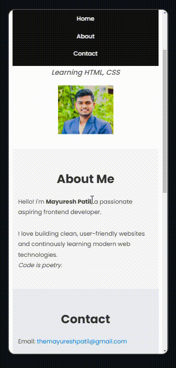

# Portfolio Homepage 

This is a beginner-friendly portfolio homepage created using **HTML5** and **CSS3** as part of my 90-day Frontend Development Journey. The project focuses on understanding semantic HTML, basic styling, responsive layout, and web accessibility.

## 🛠️ Technologies Used

- HTML5 (Semantic Structure, Forms, SEO Tags)
- CSS3 (Typography, Flexbox, Positioning, Media Queries)
- Google Fonts (Poppins)
- Favicon Integration

## 📱 Features

- Smooth scroll navigation bar
- Responsive layout for desktop and mobile
- About and Contact sections
- Semantic HTML for accessibility
- Clean footer with copyright
- Organized project structure with external CSS

## 📸 Preview

  

